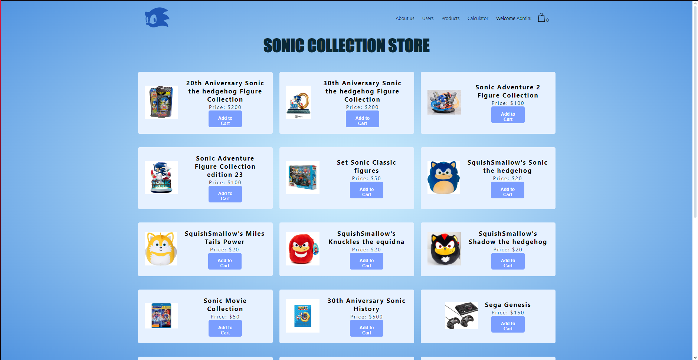

# Sonic-Collection-Store
- A proyect based on a Online Shop with a tematic of sonic by a studient sonic fan
 
- Gabriel Miguel Cabrera Samano No.Control 20491199
- proyecto que continua en relacion a la tienda online previa


## HOME
Home es la presentacion inicial de la pagina, la interaccion inicial que tiene el cliente o el administrador, funcionando de manera independientemente del usuario.
el logo en la parte superior izquierda que contiene el encabezado, funciona como un boton que redirecciona al inicio de esta pagina, de manera que independientemente de la pagina que nos encontremos, siempre retornara a este punto.
el boton "enter now" redirecciona hacia la pagina login, asi como la opcion "acount" dentro de la barra de navegacion.


## ABOUT US
About Us es la presentacion del programador/diseñador, que informa al usuario acerca de los contactos directos con el dueño de la tienda, lo que permite una interaccion semi-directa con los ajustes de la pagina o verificacion de errores.
cuenta con un boton nombrado como "lets talk" que redirecciona hacia el contacto mas directo que tiene el diseñador (en este caso el perfil de facebook).


## LOG IN
LOG IN es el medio de acceso para acceder al contenido de la tienda, poder ver los productos disponibles en la tienda, comprar productos, entre otras opciones que se explicaran despues.
LOG IN es el acceso tanto para los usuarios que esten dados de alta en el sistema, y es quien determina si el usuario que accede es un rol "Admin" o "Customer" como se explica en el siguiente codigo:
para determinar si se accedio como usuario, la pagina mandara un mensaje de alerta dependiendo el nombre del usuario, y redireccionara a sus respectivos accesos.

```
// Function to handle user login
function login() {
    var username = document.getElementById('username').value;
    var password = document.getElementById('password').value;

    var users = getUsers();
    var user = users.find(function(user) {
        return user.username === username && user.password === password;
    });

    if (user) {
        alert("Login successful! Welcome, " + user.username + "!");

        if (user.role === 'admin') {
            window.location.href = 'shopAdmin.html'; // Redirect to admin page
        } else if (user.role === 'customer') {
            window.location.href = 'shopUser.html'; // Redirect to customer page
        } else {
            alert("Unknown role. Please contact the administrator.");
        }
    } else {
        alert("Incorrect username or password. Please try again.");
    }
}
```
### PRESENTACION VISUAL DEL LOGIN:


## PRESENTACION VISUAL DEL LOGIN:
### IF IS ADMIN
en dado caso que sea el administrador quien accedio, la barra de navegacion le otorgara todas las opciones disponibles del menu, otorgando todo el control disponible de la tienda y podra modificar los usuarios dentro del sistema, el listado de los productos y realizar un test de cuenta y productos para verificar sus ajustes, y con ello tambien contiene todas las opciones de parte del usuario cliente.



### IF IS CLIENT
en dado caso que sea un cliente quien accedio, la barra de navegacion solo se limitara a otorgar las opciones de la calculadora y agregar productos a su carrito.


## BOTH CAN USE CALCULATOR
Calculator es una opcion que ambos usuarios poseen y se despliegan de la misma manera, esta opcion dentro de la barra de navegacion interactua al habilitar o deshabilitar su opcion, es decir, cuando realizamos un click en ella, funcionando como un evento.

### el cuerpo de la calculadora
```
<div class="post-calculator">
        <div class="calculator-main">
            <input type="text" class="display"/>
    
            <div class="buttons">
                <button data-value="7">7</button>
                <button data-value="8">8</button>
                <button data-value="9">9</button>
                <button class="operator" id="unique" data-value="AC">AC</button>
                <button class="operator" id="unique" data-value="DEL">DEL</button>
    
                <button data-value="4">4</button>
                <button data-value="5">5</button>
                <button data-value="6">6</button>
                <button class="operator" data-value="*">*</button>
                <button class="operator" data-value="/">/</button>
    
                <button data-value="1">1</button>
                <button data-value="2">2</button>
                <button data-value="3">3</button>
                <button class="operator" data-value="+">+</button>
                <button class="operator" data-value="-">-</button>
    
                <button data-value="0">0</button>
                <button data-value="00">00</button>
                <button data-value=".">.</button>
                <button class="operator" data-value="%">%</button>
                <button class="operator" data-value="=">=</button>
            </div>
```

### diseño en CSS  de la calculadora
```

.post-calculator {
    display: flex;
    justify-content: center;
    align-items: center;
    height: 100vh;
}

.calculator-main {
    background: #dadada;
    position: relative;
    width: 100%;
    max-width: 400px;
    border-radius: 10px;
    padding: 20px;
    box-shadow: 0 4px 6px rgba(0, 0, 0, 0.1);
}

.display {
    width: 100%;
    height: 80px;
    background-color: #ffffff;
    margin-bottom: 10px;
    font-size: 25px;
    border: none;
    outline: none;
    padding: 10px;
    text-align: right;
    color: rgb(48, 48, 48);
}

.buttons {
    display: grid;
    grid-gap: 10px;
    grid-template-columns: repeat(5, 1fr);
}

.buttons button {
    background-color: whitesmoke;
    border: none;
    border-radius: 10px;
    padding: 12px 10px;
    font-size: 20px;
    cursor: pointer;
}

.buttons button:active {
    transform: scale(0.90)
}

.operator {
    color: rgb(60, 184, 255);
}

#unique {
    background-color: rgb(32, 210, 255);
    color: white;
}
```

### codigo de como se despliega la calculadora
```
document.addEventListener("DOMContentLoaded", function () {
    var toggleCalculatorButton = document.getElementById("toggleCalculator");
    var calculatorDiv = document.getElementById("icalculator");

    toggleCalculatorButton.addEventListener("click", function () {
        if (calculatorDiv.style.display === "none") {
            calculatorDiv.style.display = "block";
        } else {
            calculatorDiv.style.display = "none";
        }
    });
});
```

### SHOW CALCULATOR:


## BOTH CAN SHOP
dentro de las opciones en la barra de navegacion, se encuentra el icono de una bolsa de mandado junto a un contador. Este icono representa los productos que son seleccionados cuando el usuario presiona el boton de "add to cart", contando asi el prodcuto añadido a la bolsa, e ira incrementado o disminuyendo el numero dependiendo de las acciones que realizamos al acceder con el icono.


## BOTH RECIVE TICKET


## CRUD USERS


## CRUD PRODUCTS


